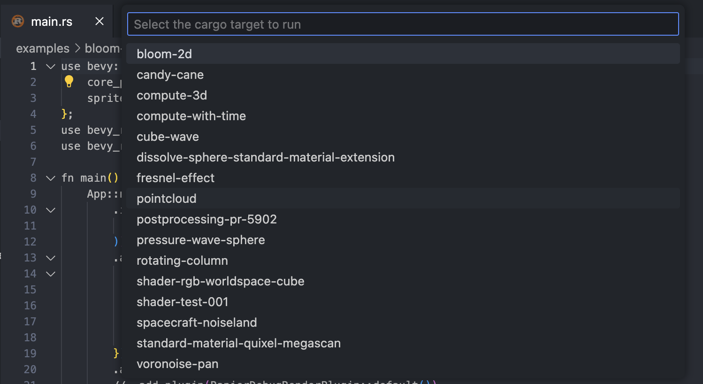

# Rust Builder
Simple helper that parses your `cargo run --bin` and `cargo run --example` output letting you select your build target easily.

## Features
 - provides a parser for finding `cargo run` targets
 - keyboard shortcut and VS Code commands for building the last target or choosing a target to build

## Usage
### Direct Builds
- `cmd/ctrl+shift+r` runs the `cargo-builder.buildLastTarget` command which will prompt you for a target the first time it is run and run it directly thereafter
- `cmd/ctrl+shift+alt+r` runs the `cargo-builder.buildTarget` command which will always prompt you for a target
- you can also can wire those commands up to whatever keybindings you want or use the command palette to run them